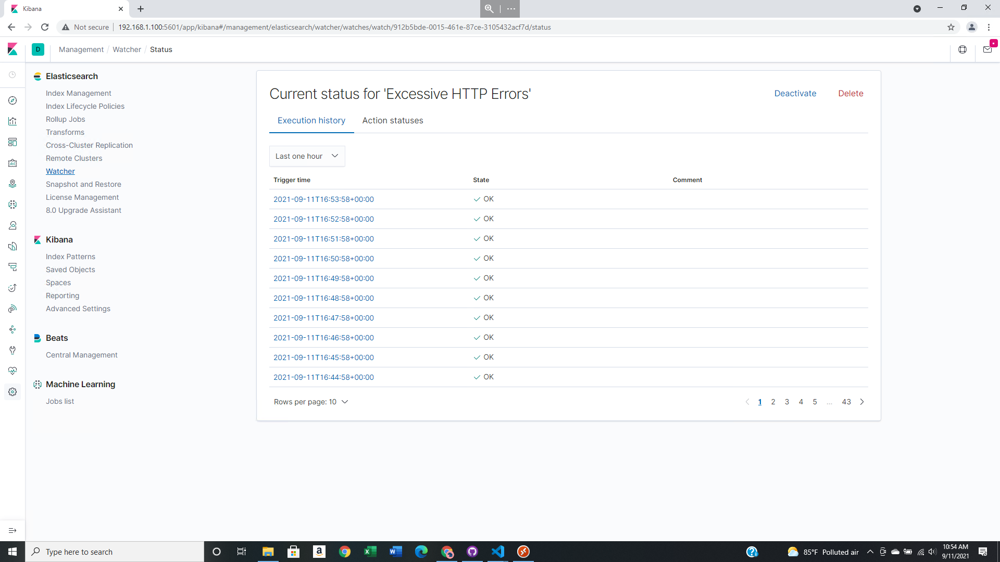
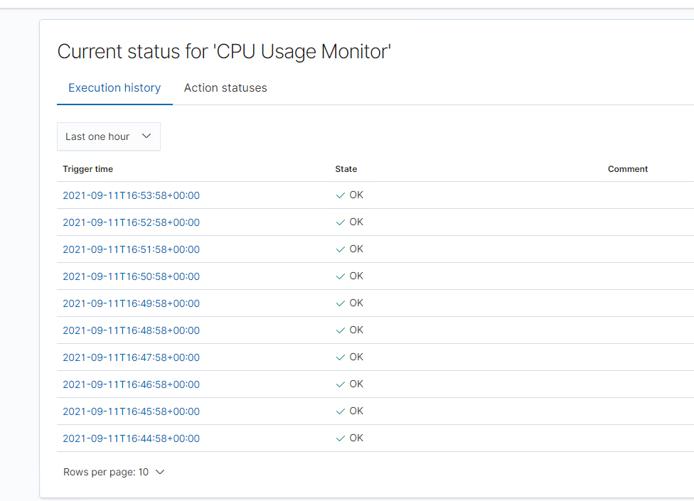

# Blue Team: Summary of Operations

### Table of Contents

- Network Topology
- Description of Targets
- Monitoring the Targets
- Patterns of Traffic & Behavior
- Suggestions for Going Further

### Network Topology

The following machines were identified on the network:

**Kali** 

- Operating System: **Debian Kali**

- Purpose: **Penetration Tester**

- IP Address: **192.168.1.90**

**ELK**

- Operating System: **Ubuntu**

- Purpose: **The ELK (Elasticsearch and Kibana) Stack**

- IP Address: **192.168.1.100**

**Target 1**

- Operating System: **Debian GNU/Linux 8**

- Purpose: **WordPress Host**

- IP Address: **192.168.1.110**

**Capstone**

- Operating System: **Ubuntu**

- Purpose: **Vulnerable Web Server**

- IP Address: **192.168.1.105

ADD NETWORK DIAGRAM!

### Description of Targets

The target of this attack was: Target 1 (192.168.1.110).
Target 1 is an Apache web server and has SSH enabled, so ports 80 and 22 are possible ports of entry for attackers. As such, the following alerts have been implemented:

### Monitoring the Targets

Traffic to these services should be carefully monitored. To this end, we have implemented the alerts below:

**Excessive HTTP Errors**

- **WHEN count() GROUPED OVER top 5 'http.response.status_code' IS ABOVE 400 FOR THE LAST 5 minutes.**

    - Metric: **WHEN count() GROUPED OVER top 5 'http.response.status_code'**

    - Threshold: **IS ABOVE 400**

    - Vulnerability Mitigated: **Enumeration/ Brute Force**

    - Reliability: **This alert is highly reliable. Measuring the error code that are 400 and above filter out the normal activity or successful responses. 400 and plus codes are client and server errors which are ones of more concern. Especially, when the error codes happen at a high rate.**

**HTTP Request Size Monitor**

- **WHEN sum() of http.request.byte OVER all documents IS ABOVE 3500 FOR THE LAST 1 minute.**

 - Metric: **WHEN sum() of http.request.byte OVER all documents**

 - Threshold: **IS ABOVE 3500**

 - Vulnerability Mitigated: **Code injection in HTTP requests (XSS and CRLF) or DDOS**

 - Reliability: **This alert could create false positives, which set the alert at medium reliability. There is a possiblity for a large number of non-malicious HTTP requests or legitimate HTTP traffic.**

**CPU Usage Monitor**

- **WHEN max() OF system.process.cpu.total.pct OVER all documents IS ABOVE 0.5 FOR THE LAST 5 minutes**

 - Metric: **WHEN max() OF system.process.cpu.total.pct OVER all documents**

 - Threshold: **IS ABOVE 0.5**

 - Vulnerability Mitigated: **Malicious software, programs (malware or viruses) running taking up resources.**

 - Reliability: **This alert is highly reliable. Even if there isn't malicious programs running, this alert can still help determine where the CPU can improve usage.**

## Suggestions for Going Further (Optional)

Each alert above pertains to a specific vulnerability/exploit. Recall that alerts only detect malicious behavior, but do not stop it. For each vulnerability/exploit identified by the alerts above, suggest a patch. E.g., implementing a blocklist is an effective tactic against brute-force attacks. It is not necessary to explain how to implement each patch.

The logs and alerts generated during the assessment suggest that this network is susceptible to several active threats, identified by the alerts above. In addition to watching for occurrences of such threats, the network should be hardened against them. The Blue Team suggests that IT implement the fixes below to protect the network:

**Excessive HTTP Errors**

Patch: **WordPress Hardening**

 

- **Regular updates should be implemented.**

    - **WordPress Core**

    - **PHP versions**

    - **Plugins**

- **Installing security plugin(s)**

    - **For example, Wordfence(added security funtionality)**

- **Disabling unused WordPress features and settings, like the following:**

    - **WordPress XML-RPC (on by default)**

- **Blocking request to /?author= by configuring web server settings.**

- **Remove the WordPress logins from being publicly accessible, specifically:**

    - **/wp-admin**

    - **/wp-login.php**

Why It Works:

- **Regular updates to WordPress, the PHP version and plugin is a simple way to implement patches or fixes to the vulnerabilites/exploits.**

- **Depending on the WordPress Security Plugins, features like this are added:**

    - **Malware Scans**

    - **Firewall**

- **REST API is used by WPScan to enumerate users. Disabiling this will help mitigate WPScan or enumeration in general.**

- **XML-RPC uses HTTP as a method of data transportation.**

- **Removeral of public access to WordPress logins will help reduce the attacks.**

**HTTP Request Size Monitor**

Patch: **Code Injection/ DDOS Hardening**

- **Implenmentation of HTTP Requests Limit on the web server.**

    - **Limits can include:**

        - **Maximum URL length**

        - **Maximum size of requests**

- **Implementation of input validation on forms.**

Why It Works: 

- **If an HTTP request length and over size limit of the request, a 404 error will occur.**

    - **This will help reject the requests that are too large.**

- **Input validation could help protect against attacks who attempt to send the server via the website or application accross a HTTP request.**

**CPU Usage Monitor**

Patch: **Virus or Malware Hardening**

- **Add or update current antivirus protection**

- **Implenment and configure Host Based Intrusion Detection System (HIDS)**

Why It Works: 

- **Antivirus protection specializes in removeral, detection and overall prevention of malicious threats against the computers.**

- **HIDS monitors and analyzes internals of the computing system.**

