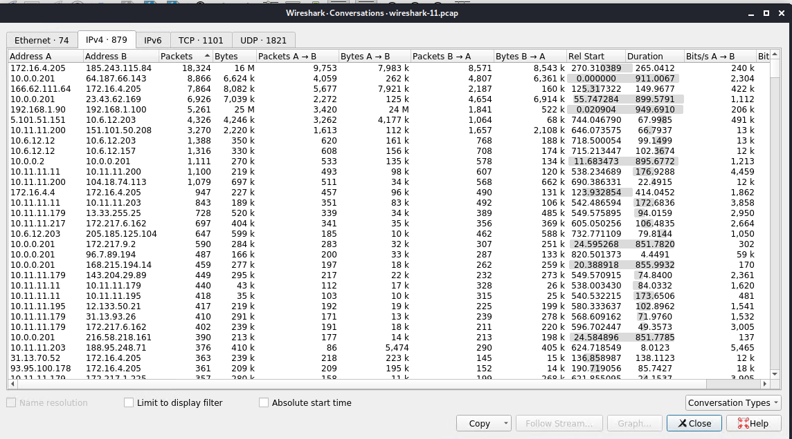

# Network Analysis

### Time Thieves

At least two users on the network have been wasting time on YouTube. Usually, IT wouldn't pay much mind to the behavior, but it seems these people have created their own web server on the corporate network. So far, Security knows the following about these time thieves:

- They have set up an Active Directory network
- They are constantly watching videos on YouTube.
- Their IP addresses are somewhere in the range 10.6.12.0/24

The traffic must be inspected to answer the following **Network Report**

1. What is the domain name of the users' custom site?

- The Domain Name: **Frank-n-Ted-DC.frand-n-ted.com.**

- Filter used in Wireshark: **ip.addr==10.6.12.0/24**

- Results:

2. What is the IP address of the Domain Controller (DC) of the AD network?

- IP address is **10.6.12.12 (Frank-n-Ted-DC.frank-n-ted.com)**

- Filter used in Wireshark: **ip.addr==10.6.12.0/24**

- Results:

3. What is the name of the malware downloaded to the 10.6.12.203 machine?

- Malware file: **june11.dll**

- Results:

    - Once the file is found, the file was exported to the Kali machine.

    - Filter used in Wireshark: **ip.addr==10.6.12.203 and http.request.method==GET**
        

4. Upload the file to VirusTotal.com 

- This type of malware is classified as a **Trojan**

- Results:

## Vulnerable Windows Machines

The Security Team received reports of an infected Windows host on the network. They know the following:

- Machines in the network live in the range 172.164.0/24.

- The domain mind-hammer.net is associated with the infected computer.

- The DC for this network lives at 172.16.4.4 and is named Mind-Hammer-DC.

- The network has standard gateway and broadcast addresses.

Inspect the traffic to answer the following questions:

1. Find the following information about the infected Windows machine:

- Host name: **ROTTERDAM-PC**

- IP address: **172.16.4.205**

- MAC addrss: **00:59:07:b0:63:a4**

- Filter used in Wireshark: **ip.src==172.16.4.4 and kerberos.CNameString**

 

2. What is the username of the Windows user whose computer is infected?

- Filter used in Wireshark: **ip.src==172.16.4.205 and kerberos.CNameString**

3. What are the IP addresses used in the actual infection traffic?

- Based on the Conversation statistics and the filtering by the highest amount of packets between the IP addresses- **172.16.4.205, 185.243.115.84, 166.62.11.64 are the infected traffic.**

4. As a bonus, retrieve the desktop background of the Windows host.

## Illegal Downloads

IT was informed that some users are torrenting on the network. The Security team does not forbid the use of torrents for legitmate purposes, such as downloading operating systems. However, they have a strict policy against copyright infringement. 

IT shared the following about the torrent activity:

- The machine using torrents live in the range 10.0.0.0/24 and are clients of AD domain.

- The DC of this domain lives at 10.0.0.2 and is named DogOfTheYear-DC.

- The DC is associated with the domain dogoftheyear.net.

The task is to isolate the torrent traffic and answer the following questions for the Network Report:

1. Find the following information about the machine with the IP address of 10.0.0.201:

- MAC address: **00:16:17:18:66:c8**

- Windows username: **elmer.blanco**

- OS version: **BLANCO-DESKTOP**

2. Which torrent file did the user download?

- The torrent downloaded **Betty_Boop_Rythm_on_the_Reservation.avi.torrent.

- Filter used in Wireshark: **ip.addr==10.0.0.201 and http.request.method==GET**

